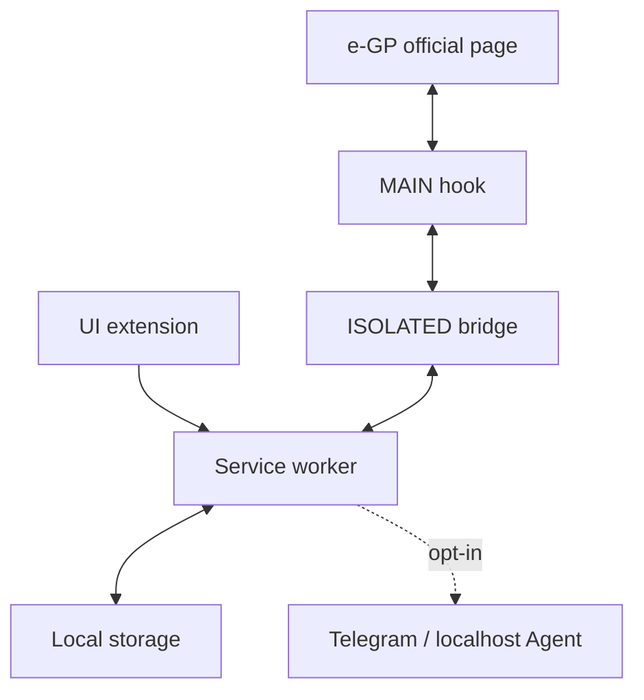

# Báo cáo so sánh Giáo Sư Cùi Bắp 4.0.1 với 3.9.2

**Ngày đánh giá:** 02/09/2026  
**Đối tượng:** Chrome extension tra cứu và hỗ trợ ra quyết định dự thầu trên Hệ thống mạng đấu thầu quốc gia  
**Phiên bản nền:** 3.9.2  
**Phiên bản được đánh giá:** 4.0.1

## 1. Kết luận điều hành

Giáo Sư Cùi Bắp 3.9.2 có lợi thế thực dụng: bao phủ nhiều nghiệp vụ đấu thầu Việt Nam trong một extension, sử dụng nguồn e-GP chính thức, lưu dữ liệu cục bộ, xuất Excel có liên kết bấm được và cho phép quét rộng mặc định 20 trang. Điểm yếu chính không nằm ở số lượng tính năng mà ở **chất lượng quyết định và độ an toàn vận hành**: dashboard chưa đóng vai trò buồng lái, chưa có pipeline Go/No-Go, thiếu lịch sử thay đổi, chuẩn hoá còn ca biên, tác vụ song song chưa cô lập và phân tích liên danh có thể gây sai tổng hợp.

Phiên bản 4.0.1 giữ lớp quyết định của 4.0, đồng thời hợp nhất chọn lọc những điểm 3.9.2 làm tốt hơn: hyperlink XLSX thật, mặc định 20 trang, lọc gói đạt ngưỡng và xoá từng gói. Lượt quét `PARTIAL` nay vẫn phát các đầu ra đã cấu hình nhưng mang cảnh báo dữ liệu chưa đầy đủ, đồng thời không gây quét lặp ngay mỗi lần Chrome khởi động. Các lớp URL/endpoint allowlist, request sanitization, cô lập job/tab, backup/import an toàn và cách tính liên danh thận trọng tiếp tục được giữ nguyên. Kết quả kiểm thử cuối được ghi tại mục 7 và biên bản phát hành.

### Quyết định hợp nhất 3.9.2 → 4.0.1

| Năng lực của 3.9.2 | Trạng thái trong 4.0.1 | Cách hợp nhất tối thiểu |
|---|---|---|
| Link nguồn trong Excel bấm được | Giữ và siết an toàn | Tạo quan hệ hyperlink OOXML cho URL HTTP(S) hợp lệ; không biến chuỗi tuỳ ý thành liên kết ngoài |
| Quét mặc định 20 trang | Giữ | Mặc định 20, cho chọn 1–40, giải thích rủi ro bỏ sót và gắn `PARTIAL` khi bị giới hạn |
| Bộ lọc chỉ gói đạt ngưỡng | Khôi phục | Nối checkbox Dashboard với `filterAndSort({ onlyMatched: true })` đã có trong lớp quyết định |
| Xoá từng gói | Khôi phục | Gọi `DELETE_TENDER` sau xác nhận và cập nhật lại KPI, pipeline, ưu tiên và danh sách |
| Phát lại request thô đã bắt | Không hợp nhất | Giữ truy vấn công khai đã scrub; để trang e-GP tạo token/phiên hiện hành và chỉ chấp nhận endpoint trong allowlist |

Mức đánh giá đề xuất:

| Trục | Đánh giá | Nhận định |
|---|---:|---|
| Phù hợp nghiệp vụ Việt Nam | Tốt | Bao phủ TBMT, KHLCNT, kết quả, mở thầu, nhà thầu, chủ đầu tư và địa bàn |
| Hỗ trợ quyết định | Tốt hơn rõ rệt | Pipeline, người phụ trách, ghi chú, Radar và hành động tiếp theo đã biến danh sách thành quy trình |
| Truy vết nguồn | Khá tốt | URL chính thức được chuẩn hoá/giới hạn; người dùng vẫn phải đối chiếu hồ sơ nguồn |
| Quyền riêng tư mặc định | Khá | Dữ liệu cục bộ, không có backend nhà phát triển; chưa mã hoá đầu-cuối |
| An toàn tích hợp | Khá | Đã giới hạn endpoint, loại bí mật và tắt tích hợp sau import; còn phụ thuộc hệ thống ngoài |
| Khả năng kiểm thử | Khá | Có hồi quy tự động tốt hơn; còn thiếu E2E live e-GP và kiểm thử hiệu năng dài hạn |
| Sẵn sàng phát hành rộng | Có điều kiện | Cần canary trực tiếp trên e-GP, kiểm tra quyền, hiệu năng và quy trình rollback |

**Kết luận:** 4.0.1 là một bản nâng cấp có cơ sở và đủ phạm vi để đưa vào pilot/canary sau khi QA tự động cuối đạt. Không có căn cứ để gọi bất kỳ extension phụ thuộc cổng e-GP nào là “100% hoàn hảo”; chất lượng phát hành cần được duy trì bằng canary trực tiếp, giám sát thay đổi và quy trình rollback.

## 2. Phạm vi và phương pháp

Đánh giá dựa trên:

- so sánh mã nguồn/manifest giữa 3.9.2, 4.0.0 và bản hợp nhất 4.0.1;
- rà soát luồng dữ liệu, quyền Chrome, storage, sao lưu/nhập và tích hợp ngoài;
- đọc các mô-đun quyết định, chuẩn hoá, phân tích nhà thầu/chủ đầu tư/liên danh;
- chạy bộ kiểm thử Node.js hiện có;
- đối chiếu định vị với một số sản phẩm đấu thầu tại Việt Nam và quốc tế qua tài liệu công khai của sản phẩm.

Không nằm trong phạm vi xác nhận:

- kiểm toán bảo mật độc lập hoặc pentest;
- rà soát pháp lý chính thức;
- kiểm thử tải dài hạn;
- duyệt Chrome Web Store;
- bảo đảm hoạt động với mọi phiên đăng nhập, CAPTCHA hoặc thay đổi tương lai của e-GP;
- xác nhận độ chính xác tuyệt đối trên toàn bộ dữ liệu lịch sử.

## 3. Đánh giá phiên bản 3.9.2

### 3.1. Ưu điểm

#### Bao phủ nghiệp vụ rộng

3.9.2 không chỉ là ô tìm kiếm. Phiên bản này đã có năm luồng lõi: tìm TBMT, tra kết quả theo mã số thuế, phân tích biên bản mở thầu/giảm giá, tìm KHLCNT và quét thị trường theo địa bàn. Các màn hình bổ sung về nhà thầu 360, chủ đầu tư, phân tích, bộ lọc lưu, lịch quét, thông báo và xuất Excel có liên kết nguồn bấm được tạo thành một công cụ làm việc tương đối đầy đủ cho doanh nghiệp xây dựng.

#### Bám nguồn chính thức

Dữ liệu được lấy từ e-GP và có thể dẫn người dùng về nguồn để kiểm tra. Đây là lợi thế quan trọng so với quy trình sao chép dữ liệu thủ công hoặc phụ thuộc hoàn toàn vào một kho dữ liệu tổng hợp bên thứ ba.

#### Local-first

Không có backend của nhà phát triển trong mã được rà soát. Cấu hình, cơ hội và lịch sử được lưu cục bộ, giúp giảm việc chuyển dữ liệu doanh nghiệp ra ngoài khi người dùng không bật Telegram hoặc Agent cục bộ.

#### Giá trị thực tế cao

Sự kết hợp giữa tra cứu, cảnh báo và xuất báo cáo tiết kiệm nhiều thao tác lặp lại. Với đội ngũ nhỏ, việc gom các luồng này vào một extension có thể giảm thời gian chuyển qua lại giữa trang, bảng tính và ghi chú rời rạc.

### 3.2. Khuyết điểm và tác động

| Vấn đề 3.9.2 | Tác động nghiệp vụ/kỹ thuật | Mức ưu tiên |
|---|---|---:|
| Dashboard thiên về danh sách | Người quản lý vẫn phải tự suy luận cơ hội nào cần xử lý trước | Cao |
| Chưa có pipeline Go/No-Go | Không biết ai chịu trách nhiệm, quyết định đang ở đâu, vì sao bỏ/tham gia | Cao |
| Chưa có Radar thay đổi | Dễ bỏ lỡ đổi hạn, giá, địa điểm hoặc đơn vị | Cao |
| Không tách rõ điểm phù hợp và độ đầy đủ | Người dùng có thể hiểu nhầm điểm cao là dữ liệu chắc chắn hoặc khả năng thắng | Cao |
| Chuẩn hoá từ khoá, tiền, ngày còn ca biên | Có thể xếp hạng sai, sai đơn vị tiền hoặc chấp nhận ngày không tồn tại | Cao |
| Phát lại request đã bắt | Token/CAPTCHA/CSRF nhanh hết hạn; lỗi khó tái hiện; bề mặt bí mật rộng | Cao |
| Content script chạy quá rộng | Tăng bề mặt can thiệp và khả năng xung đột không cần thiết | Trung bình |
| Tác vụ/tab chưa cô lập đủ | Huỷ/đóng một tab có thể ảnh hưởng công việc khác; khó tin vào trạng thái hoàn tất | Cao |
| Import/sao lưu giữ quá nhiều | Có nguy cơ mang theo bí mật Telegram và bật tự động hoá ngoài ý muốn | Cao |
| Ghép mảng liên danh theo vị trí | Tên và mã số thuế có thể bị gán sai khi dữ liệu không đồng thứ tự | Cao |
| Nhân giá trị gói cho từng thành viên | Thổi phồng doanh thu/HHI và dẫn đến kết luận sai về đối thủ/thị trường | Cao |
| Chưa có hồi quy tự động | Mỗi sửa đổi có thể làm hỏng luồng cũ mà không được phát hiện trước phát hành | Cao |

## 4. 4.0.1 đã khắc phục và giữ lại những gì

| Hạn chế/cần giữ | Thay đổi trong 4.0.1 | Giá trị mang lại | Rủi ro còn lại |
|---|---|---|---|
| Danh sách khó ưu tiên | KPI, cơ hội #1, lọc/sắp xếp, phân trang | Biến dashboard thành buồng lái hằng ngày | Cần kiểm tra hiệu năng với kho dữ liệu lớn |
| Thiếu quy trình quyết định | 6 trạng thái, owner, note, timestamp, watchlist | Theo dõi trách nhiệm và lý do quyết định | Chưa đồng bộ nhiều người/máy |
| Không biết dữ liệu đã đổi | Radar cho 5 trường, lưu 20 mốc | Phát hiện thay đổi có ý nghĩa | Chưa có lịch sử bất biến hoặc đồng bộ server |
| Điểm số dễ bị hiểu nhầm | Độ đầy đủ dữ liệu, nhãn chất lượng, cảnh báo kiểm chứng, onboarding | Minh bạch hơn về chất lượng đầu vào | Vẫn cần đào tạo người dùng và đối chiếu nguồn |
| Khớp từ khoá trùng | Khớp theo biên cụm từ, tránh lồng nhau | Điểm phù hợp ổn định hơn | Tìm kiếm ngữ nghĩa/đồng nghĩa còn hạn chế |
| Tiền/ngày dễ parse sai | Hỗ trợ dấu phân tách VI/EN và từ chối ngày vô lý | Giảm sai lệch xếp hạng/tổng hợp | Cần mở rộng bộ fixture từ dữ liệu e-GP thật |
| URL nguồn lỏng | Chỉ nhận HTTPS đúng origin chính thức | Chống link giả/JS URL | Link hợp lệ vẫn có thể hết hiệu lực hoặc đổi route |
| Request cũ chứa bí mật | Sanitization sâu, header an toàn, endpoint chính xác, dùng phiên hiện hành của trang | Giảm lỗi do token cũ và giảm rò rỉ bí mật | e-GP đổi endpoint/schema vẫn có thể làm hỏng luồng |
| Content script quá rộng | Chỉ chạy trên trang lựa chọn nhà thầu | Giảm bề mặt quyền/can thiệp | Các route mới của e-GP cần cập nhật có kiểm soát |
| Tác vụ chồng chéo | Job ID + tab binding + timeout/reconcile | Huỷ/đóng đúng tác vụ, trạng thái đáng tin hơn | Cần stress test nhiều tab và phiên dài |
| Hai lệnh khởi chạy có thể tranh cùng trạng thái | Claim job nguyên tử trong storage | Chỉ một tác vụ được quyền điều phối mỗi loại công việc | Vẫn cần stress test trên nhiều profile/thiết bị yếu |
| Mất message khi chuyển trang có thể bỏ dữ liệu | Chỉ chuyển trang sau ACK; retry cùng `pageIndex` và ghi idempotent | Giảm mất trang và không nhân đôi dữ liệu khi retry | Chưa có E2E live với mạng chập chờn/e-GP thật |
| Timeout tuyệt đối dù tác vụ vẫn tiến triển | Lease dựa trên `lastProgressAt`, gia hạn sau khi ghi nhận trang | Tác vụ dài không bị cắt chỉ vì vượt một mốc thời gian cố định | Vẫn cần giới hạn an toàn và đo tải dài hạn |
| Worker khởi động lạnh có thể để job mồ côi | Cold-start reconcile chốt coordinator không thể resume | Không giữ trạng thái “đang chạy” giả vô hạn | BBMT chi tiết vẫn chưa resume đúng cursor |
| Kết quả một phần bị hiểu là đủ | Đánh dấu incomplete/partial | Tránh dùng tổng hợp thiếu làm kết luận | UI phải luôn làm nổi bật trạng thái này |
| Lượt `PARTIAL` không đi qua đường cảnh báo của `SUCCESS` | Vẫn gửi Desktop, gói điểm cao, Telegram và báo cáo di động nếu đã bật; Desktop/Telegram ghi rõ dữ liệu chưa đầy đủ | Không bỏ lỡ cơ hội mới chỉ vì lượt quét bị giới hạn/gián đoạn | Người dùng vẫn phải quét bù phần thiếu và đối chiếu nguồn |
| Startup có thể lặp sau lượt `PARTIAL` | Thêm thời gian chờ hai giờ cho lượt một phần, so với 18 giờ sau `SUCCESS` | Tránh bắn request lặp mỗi lần mở Chrome nhưng vẫn quét bù sớm | Chưa phải cơ chế resume theo cursor |
| Hyperlink Excel, mặc định 20 trang, lọc đạt ngưỡng và xoá từng gói của 3.9.2 cần được giữ | Khôi phục đúng bốn hành vi, không lấy lại raw request replay | Không đánh đổi thao tác người dùng khi nâng cấp lên lớp an toàn 4.0 | Cần canary trên dữ liệu thật và mở file bằng Excel/LibreOffice |
| Backup mang bí mật | Chỉ xuất safe backup theo danh sách trắng; bỏ đường full backup; import giới hạn/khử bí mật/tắt automation | Giảm nguy cơ vô tình chuyển Bot Token, Chat ID hoặc request phiên sang máy khác | Backup vẫn chứa dữ liệu nghiệp vụ; local storage chưa mã hoá |
| Liên danh nhân trùng | Tách solo/venture, unique package, HHI chỉ trên solo, tên chỉ từ dữ liệu xác minh | Tổng hợp thận trọng, giảm méo số | Dữ liệu nguồn thiếu vai trò/tỷ lệ thành viên nên chưa thể phân bổ chính xác |
| Thiếu test | Bộ test Node.js cho logic, cấu trúc, bảo mật và xuất tệp | Giảm hồi quy trước phát hành | Chưa có E2E live và kiểm toán độc lập |

## 5. Kiến trúc và ranh giới tin cậy

### 5.1. Sơ đồ



### 5.2. Các lớp

| Lớp | Thành phần | Trách nhiệm |
|---|---|---|
| Trình bày | `popup`, `dashboard`, `search`, `plans`, `winners`, `bidopen`, `contractors`, `profile`, `investor`, `market`, `analytics`, `options`, `diagnostics`, `onboarding`, `privacy` | Hiển thị, nhập tiêu chí, điều khiển quy trình |
| Điều phối | `background.js` | Trạng thái, lịch, tab/job, thông báo, tải/xuất, tổng hợp |
| Cầu nối trang | `page-hook.js`, `content.js` | Giao tiếp an toàn hơn với trang e-GP, DOM fallback, phân trang, huỷ |
| Nghiệp vụ | `lib/core.js`, `lib/decision.js`, `lib/profile360.js`, `lib/investor.js`, `lib/analytics.js`, các mô-đun tra cứu | Chuẩn hoá, chấm điểm, quyết định và phân tích |
| Báo cáo/an toàn | `lib/xlsx.js`, `lib/provenance.js`, `lib/redact.js`, `lib/attachments.js` | Xuất tệp, truy vết nguồn, che bí mật, tài liệu |
| Lưu trữ | `chrome.storage.local` | Cấu hình, kết quả, lịch sử, pipeline và cache |

### 5.3. Ranh giới tin cậy

1. **Trang e-GP:** nguồn chính thức nhưng là hệ thống ngoài, có thể đổi route/schema/CAPTCHA.
2. **MAIN world:** cần để tương tác với fetch/XHR của trang; phải giữ allowlist tối thiểu.
3. **ISOLATED world:** cầu nối phải kiểm tra loại thông điệp, mã tác vụ và tab.
4. **Service worker:** nơi có quyền Chrome cao nhất; mọi dữ liệu đi ra ngoài phải là opt-in và được lọc.
5. **Telegram:** bên thứ ba; Bot Token, Chat ID và nội dung cảnh báo là dữ liệu nhạy cảm.
6. **Agent localhost:** phần mềm ngoài extension; chỉ gọi khi người dùng yêu cầu tải tài liệu.
7. **Tệp export/backup:** sau khi tải xuống không còn nằm trong cơ chế bảo vệ của extension.

## 6. Quyền riêng tư và bảo mật

### 6.1. Điểm tốt

- Không thu thập thông tin đăng nhập e-GP.
- Không có backend, quảng cáo hoặc analytics của nhà phát triển trong mã được đánh giá.
- Logic chấm điểm/ra quyết định chạy cục bộ.
- CSP chặn script ngoài, object, base URI và frame ancestor.
- Storage được giới hạn cho trusted contexts khi API Chrome hỗ trợ.
- URL, endpoint, method, body và header có kiểm tra allowlist.
- Các trường token/CAPTCHA/CSRF/XSRF/JWT/session/auth/cookie/password được loại sâu khỏi request template.
- Import không tự kích hoạt Telegram, lịch quét hoặc xuất tự động.
- Chẩn đoán và safe backup đã được thiết kế để giảm lộ bí mật.
- Không có tích hợp OpenAI trong extension và không yêu cầu API key phía trình duyệt. Nếu bổ sung AI, khoá phải nằm ở backend có kiểm soát quyền, redaction, quota/chi phí và audit; mọi tóm tắt E-HSMT phải opt-in và dẫn về đúng tệp/trang nguồn.

### 6.2. Rủi ro còn lại

| Rủi ro | Khả năng/tác động | Khuyến nghị |
|---|---|---|
| Local storage không mã hoá đầu-cuối | Người có quyền OS/Chrome profile có thể đọc | Dùng profile riêng, khoá thiết bị; cân nhắc mã hoá backup bằng passphrase ở phiên bản sau |
| Telegram làm dữ liệu rời máy | Nội dung cảnh báo chịu chính sách bên thứ ba | Mặc định tắt; cho phép cấu hình mức tối thiểu thông tin gửi |
| Safe backup vẫn chứa dữ liệu nghiệp vụ | Có thể lộ cơ hội, quyết định, người phụ trách hoặc ghi chú nếu chia sẻ sai nơi | Bảo vệ tệp như dữ liệu nội bộ; cân nhắc mã hoá backup bằng passphrase ở phiên bản sau |
| e-GP thay endpoint/schema | Gián đoạn hoặc đọc sai trường | Canary định kỳ, fixture có version, kill-switch cục bộ và rollback |
| Phân tích dựa trên dữ liệu thiếu | Tổng số/HHI có thể không đại diện thị trường thật | Luôn hiển thị phạm vi mẫu, trạng thái partial và thời điểm cập nhật |
| Quyền `tabs`, `downloads`, `notifications` tương đối mạnh | Sai sót service worker có thể ảnh hưởng trải nghiệm | Kiểm tra quyền tối thiểu mỗi phiên bản; viết test cho mọi luồng đi ra ngoài |
| Agent localhost nằm ngoài extension | Chất lượng/an toàn phụ thuộc Agent | Xác thực protocol, checksum tệp, cảnh báo rõ trước khi mở/tải |
| Chrome dọn service worker giữa luồng BBMT chi tiết | Alarm sẽ chốt tác vụ an toàn nhưng chưa tiếp tục từ cursor cũ | Chạy lại tác vụ; phiên bản sau lưu cursor/checkpoint theo từng gói |

### 6.3. Không nên tuyên bố

- Không tuyên bố “ẩn danh tuyệt đối”, “không thể rò rỉ” hoặc “tuân thủ pháp luật tuyệt đối”.
- Không gọi điểm phù hợp là xác suất thắng.
- Không gọi độ đầy đủ dữ liệu là độ chính xác thống kê.
- Không dùng cảnh báo để kết luận thông thầu, vi phạm hay năng lực pháp lý của một tổ chức.
- Không gọi một kết quả phân trang một phần là toàn bộ thị trường.

## 7. Bằng chứng kiểm thử

Lệnh chuẩn:

```bash
npm test
```

Kết quả tại thời điểm đánh giá: **57/57 kiểm thử tự động đạt, 0 lỗi, 0 bỏ qua**.

### Nhóm được bao phủ

- chuẩn hoá tiếng Việt, từ khoá, mã định danh;
- tiền tệ, số thập phân và ngày hợp lệ/không hợp lệ;
- URL chính thức, request allowlist và redaction;
- safe backup theo danh sách trắng; claim nguyên tử, ACK/retry, chống ghi trùng trang, lease theo tiến triển và cold-start reconcile;
- pipeline, thứ tự OPEN/PLAN, độ đầy đủ, cảnh báo, Radar và hành động;
- manifest, CSP, extension key, kích thước icon;
- cú pháp/import JavaScript, tài nguyên tham chiếu, ID HTML trùng và inline script;
- workbook XLSX, gồm quan hệ hyperlink ngoài cho URL HTTP(S) hợp lệ;
- mặc định/migration giới hạn 20 trang, lớp lọc `onlyMatched` và terminalization `PARTIAL`/`TIMEOUT`;
- rà soát tĩnh UI xoá từng gói và đường thông báo/startup cho lượt `PARTIAL`;
- nhận diện liên danh, không ghép name/code theo index, không nhân giá trị và HHI.

### Khoảng trống kiểm thử

- Chưa có E2E chạy định kỳ trên e-GP thật.
- Môi trường bàn giao không có Chromium/Chrome nhị phân nên chưa chạy được E2E giao diện thật trong lần đóng gói này.
- Chưa có fixture đủ lớn từ nhiều thời kỳ/loại hồ sơ.
- Chưa có stress test hàng chục tab, hàng trăm nghìn bản ghi và service worker bị suspend/resume dài.
- Chưa có accessibility audit tự động và kiểm thử bàn phím/screen reader.
- Chưa có đo hiệu năng/render/memory theo ngưỡng phát hành.
- Chưa có kiểm toán bảo mật độc lập.

## 8. Checklist canary e-GP

### A. Chuẩn bị

- [ ] Dùng Chrome profile thử nghiệm, không dùng ngay trên dữ liệu sản xuất duy nhất.
- [ ] Ghi Chrome version, extension version, ngày giờ, trạng thái đăng nhập và điều kiện mạng.
- [ ] Xuất safe backup; giữ thư mục/ZIP 3.9.2 và hướng dẫn rollback.
- [ ] Tắt Telegram, quét theo lịch, quét khi khởi động và xuất tự động.
- [ ] Chọn bộ mẫu đã biết gồm ít nhất một TBMT mở, một KHLCNT, một kết quả, một biên bản mở thầu và một trường hợp liên danh.

### B. Smoke test tìm kiếm

- [ ] Mở e-GP qua extension; hoàn tất CAPTCHA/đăng nhập trên trang chính thức nếu có.
- [ ] Tìm theo mã TBMT đã biết và đối chiếu bảy trường: mã/phiên bản, tên, giá, hạn, chủ đầu tư/bên mời thầu, địa điểm và URL nguồn.
- [ ] Xác nhận mọi URL kết quả dùng HTTPS và đúng origin `muasamcong.mpi.gov.vn`.
- [ ] Thử từ khoá tiếng Việt có dấu/không dấu và truy vấn không có kết quả.
- [ ] Quét ít nhất hai trang; đối chiếu số lượng và thông báo partial/capped.
- [ ] Tạo một lượt `PARTIAL` kiểm soát; xác nhận Desktop/Telegram (nếu bật) ghi rõ dữ liệu chưa đầy đủ và startup không quét lặp ngay.
- [ ] Lưu bộ lọc rồi quét lại; xác nhận không phát sinh bản ghi trùng bất thường.

### C. Quy trình quyết định

- [ ] Gán trạng thái, người phụ trách và ghi chú; tải lại extension rồi quét lại.
- [ ] Xác nhận dữ liệu quyết định vẫn tồn tại và watchlist thay đổi đúng trạng thái.
- [ ] Dùng một gói đã sửa đổi hoặc hai snapshot kiểm soát để kiểm tra Radar.
- [ ] Kiểm tra giá trị cũ/mới, thời điểm và giới hạn lịch sử; không báo “đổi” chỉ vì trường mới bị thiếu.
- [ ] Xác nhận OPEN luôn xếp trước PLAN trong cùng tập kết quả.
- [ ] Bật bộ lọc **Chỉ gói đạt ngưỡng**, sau đó xoá một gói thử nghiệm và xác nhận KPI/danh sách được cập nhật đúng.

### D. Các luồng chuyên sâu

- [ ] Tra kết quả theo đúng mã số thuế.
- [ ] Quét biên bản mở thầu/giảm giá và kiểm tra trạng thái thắng/thua/không xác định.
- [ ] Tìm KHLCNT, quét địa bàn và hồ sơ chủ đầu tư.
- [ ] Với liên danh, xác nhận mỗi gói chỉ đếm một lần; giá trị không nhân cho mọi thành viên; HHI chỉ dùng dữ liệu độc lập.
- [ ] Mở hai hoặc ba tác vụ ở tab khác nhau; huỷ/đóng một tab và xác nhận tab còn lại tiếp tục.
- [ ] Để một tác vụ timeout có kiểm soát và xác nhận trạng thái không bị treo là “đang chạy”.

### E. Xuất dữ liệu và quyền riêng tư

- [ ] Mở tệp Excel, kiểm tra tên cột, Unicode, số tiền, ngày, các trường decision/owner/note/change và bấm thử liên kết nguồn về đúng e-GP.
- [ ] Mở safe backup dưới dạng văn bản; tìm `token`, `chatId`, `authorization` và xác nhận không có giá trị bí mật.
- [ ] Xác nhận không còn thao tác full backup và safe backup không chứa Bot Token, Chat ID, queue/request hoặc template phiên.
- [ ] Nhập backup vào profile thử nghiệm; xác nhận Telegram/automation vẫn tắt và bí mật không được khôi phục.
- [ ] Xuất chẩn đoán; xác nhận không có tên/mã số thuế/giá trị/token trong phần endpoint nhạy cảm.
- [ ] Chỉ thử Factory Reset trên profile dùng một lần; xác nhận yêu cầu hai lần và dữ liệu bị xoá.

### F. Tích hợp tuỳ chọn

- [ ] Nhập Bot Token/Chat ID thử nghiệm riêng, gửi thông báo tối thiểu rồi tắt.
- [ ] Kiểm tra nội dung không chứa dữ liệu vượt quá nhu cầu.
- [ ] Nếu dùng Agent localhost, kiểm tra đúng port, đúng hành động người dùng và tệp đầu ra mở được.

### G. Tiêu chí đạt/không đạt

**Đạt** khi:

- không có lỗi runtime chặn luồng;
- không có liên kết nguồn ngoài origin chính thức;
- không sai bảy trường chính trên bộ mẫu;
- mọi dữ liệu partial/capped đều hiển thị rõ;
- không trùng bản ghi bất thường;
- pipeline/Radar tồn tại sau restart;
- tệp xuất mở được và safe backup không lộ bí mật;
- tác vụ song song được cô lập.

**Không đạt** nếu xuất hiện một trong các dấu hiệu:

- nguồn URL sai miền hoặc giá trị trường không khớp trang gốc;
- CAPTCHA/token bị lưu hoặc xuất ra file;
- một tab dừng tác vụ khác;
- dữ liệu một phần được trình bày như đầy đủ;
- liên danh bị nhân giá trị;
- Telegram/automation tự bật sau import;
- service worker lặp request liên tục khi e-GP lỗi.

Khi không đạt: dừng lịch quét, không “thử lại” liên tục, lưu chẩn đoán đã ẩn bí mật, ghi thao tác/URL/thời điểm và rollback về bản ổn định.

## 9. Vị thế thị trường và khoảng trống sản phẩm

### 9.1. Ma trận tham chiếu

Các sản phẩm dưới đây được đối chiếu lại ngày 02/09/2026 qua trang sản phẩm hoặc tài liệu chính thức. Chúng chỉ được dùng để tham chiếu hướng phát triển, không phải kết luận rằng mọi tính năng có cùng chất lượng hoặc cùng phạm vi dữ liệu. Với sản phẩm thương mại, phạm vi thực tế phụ thuộc gói thuê bao/địa bàn và mô tả tính năng vẫn là tuyên bố của nhà cung cấp.

| Sản phẩm | Điểm mạnh công khai đáng học | Khoảng trống/cơ hội cho Giáo Sư Cùi Bắp |
|---|---|---|
| [Hệ thống mạng đấu thầu quốc gia](https://muasamcong.mof.gov.vn/) ([host vận hành](https://muasamcong.mpi.gov.vn/web/guest), [quy định địa chỉ](https://baochinhphu.vn/quy-dinh-dang-tai-thong-tin-dau-thau-lua-chon-nha-dau-tu-tren-he-thong-mang-dau-thau-quoc-gia-102251030154321938.htm)) | Nguồn chính thức cho KHLCNT, TBMT, YCBG, kết quả và nghiệp vụ đấu thầu điện tử; địa chỉ `.mof.gov.vn` hiện chuyển tới host vận hành | Extension nên bổ sung lớp quyết định mà không che khuất nguồn hoặc tự coi mình là “cơ sở dữ liệu sự thật” |
| [DauThau.info](https://dauthau.asia/) ([bảng tính năng](https://dauthau.asia/about/gioi-thieu-tinh-nang.html)) | Tìm kiếm/phân tích dữ liệu thầu, bộ lọc và thông báo, Excel, API, dữ liệu nhà thầu/bên mời thầu | Khác biệt bằng trải nghiệm ngay trên nguồn chính thức, local-first và quyết định có bằng chứng |
| [BidWinner](https://bidwinner.info/) | Tìm theo từ khoá/lĩnh vực/địa phương, theo dõi chủ đầu tư, tra cứu đối thủ/hàng hoá/máy thi công và báo cáo so sánh | Tập trung sâu hơn vào workflow công trình, deadline, BOQ và năng lực thực thi; các kênh thông báo nên được kiểm tra trực tiếp trước khi dùng làm benchmark |
| [TED](https://ted.europa.eu/en/) ([giới thiệu](https://ted.europa.eu/en/help/about-ted)) | Tìm nhanh/nâng cao/expert, CPV/NUTS, lưu tìm kiếm, cảnh báo/RSS, chia sẻ/xuất và Search API | Học cách lưu truy vấn có cấu trúc, taxonomy, feed và liên kết vòng đời thông báo |
| [SAM.gov Contract Opportunities](https://sam.gov/opportunities) ([API](https://open.gsa.gov/api/get-opportunities-public-api/)) | Tìm kiếm/lưu tìm kiếm, theo dõi cơ hội, thông báo, tải dữ liệu/báo cáo và API công khai | Cần lịch sử thay đổi, API/tích hợp có quản trị và nguồn/provenance rõ; API có key/version cần được thiết kế minh bạch |
| [GovWin IQ](https://www.deltek.com/products/govwin/) | Tín hiệu trước RFP có chuyên gia xác minh, cảnh báo thay đổi, gợi ý độ phù hợp/tóm tắt và bối cảnh cạnh tranh | Dài hạn có thể thêm tín hiệu sớm và capability fit, nhưng phải minh bạch nguồn và tránh tuyên bố dự báo quá mức |
| [GovSpend AI](https://govspend.com/ai/) | Hồ sơ doanh nghiệp và feed cơ hội cá nhân hoá, tìm kiếm ngôn ngữ tự nhiên, Chat/tóm tắt tài liệu và Notebook | Có thể thêm “hộ chiếu năng lực” doanh nghiệp và briefing có trích dẫn, theo cơ chế opt-in |
| [Tenderwell](https://tenderwell.com/) ([các gói](https://tenderwell.com/plans)) | CSDL tender đa quốc gia, bộ lọc/alert/bookmark, lịch sử đối thủ/award, Excel và tóm tắt AI theo gói | Tham khảo UX tìm kiếm và cảnh báo, nhưng không nên hy sinh độ sâu nghiệp vụ Việt Nam để chạy theo độ phủ toàn cầu |
| [ConstructConnect Project Intelligence](https://www.constructconnect.com/en/products/project-intelligence) / [Autodesk BuildingConnected](https://construction.autodesk.com/products/buildingconnected/) | Lead công trình, bid board, deadline, tài liệu, cộng tác, takeoff/estimating và qualification | Đây là hướng khác biệt lớn nhất cho thị trường xây dựng: từ cơ hội đến hồ sơ, BOQ, chi phí và giao việc |

### 9.2. Định vị đề xuất

Không nên chạy đua trở thành kho dữ liệu lớn nhất. Định vị mạnh và khó sao chép hơn là:

> **Trợ lý ra quyết định dự thầu ngay trên nguồn chính thức — từ phát hiện thay đổi đến Go/No-Go có người chịu trách nhiệm và bằng chứng để kiểm tra.**

Ba trụ cột:

1. **Nguồn và provenance:** mọi chỉ báo quay được về đúng hồ sơ e-GP/tệp/trang.
2. **Quy trình ra quyết định:** pipeline, deadline, owner, ghi chú, lịch sử và kiểm soát dữ liệu một phần.
3. **Chuyên sâu xây dựng:** năng lực tương tự, BOQ, khối lượng, thiết bị, nhân sự, địa bàn, chi phí và liên danh.

## 10. Mười tính năng khác biệt, xếp theo giá trị/khả thi

Thang điểm 1–5; **Ưu tiên** cân bằng giá trị người dùng với độ khả thi, không chỉ theo độ “ấn tượng”.

| # | Tính năng | Giá trị | Khả thi | Ưu tiên | Ghi chú triển khai an toàn |
|---:|---|---:|---:|---:|---|
| 1 | Lịch deadline + xuất ICS và nhắc theo mốc | 5 | 5 | P0 | Chạy local; phân biệt hạn chính thức và hạn nội bộ |
| 2 | Hồ sơ năng lực doanh nghiệp có cấu trúc | 5 | 4 | P0 | Thiết bị, nhân sự, hợp đồng tương tự, địa bàn; cho người dùng kiểm soát dữ liệu |
| 3 | Capability Fit có giải thích | 5 | 4 | P0 | Chỉ ra tiêu chí khớp/không khớp; không gọi là xác suất thắng |
| 4 | Radar chi tiết có lịch sử và liên kết nguồn | 5 | 4 | P0 | Hiển thị before/after, thời điểm, snapshot và trạng thái xác minh |
| 5 | Liên kết vòng đời KHLCNT → TBMT → sửa đổi → mở thầu → kết quả | 5 | 3 | P1 | Dùng mã chính thức và confidence; cho phép sửa liên kết thủ công |
| 6 | Ma trận tuân thủ E-HSMT có trích dẫn tệp/trang | 5 | 3 | P1 | Parser xác định trước; AI chỉ opt-in, mỗi kết luận phải có citation |
| 7 | Bid workspace/board cho đội thầu | 5 | 3 | P1 | Checklist, owner, RACI, file, mốc nội bộ; cần mô hình đồng bộ/quyền riêng tư nếu đa thiết bị |
| 8 | Phân tích BOQ và ước tính sơ bộ | 5 | 2 | P2 | Tách dữ liệu gốc, giả định và giá tham khảo; không tự quyết giá chào |
| 9 | Benchmark đối thủ/chủ đầu tư có cỡ mẫu | 4 | 3 | P2 | Hiển thị phạm vi, cỡ mẫu, thời gian, solo/liên danh; không cáo buộc hành vi |
| 10 | Briefing ngôn ngữ tự nhiên có provenance | 4 | 2 | P2 | Opt-in nếu dùng cloud AI; không gửi bí mật mặc định; mọi nhận định dẫn về bằng chứng |

## 11. Roadmap đề xuất

### 4.0.x — Ổn định phát hành

- Chạy và lưu biên bản canary e-GP theo mỗi lần thay đổi cổng.
- Thêm fixture từ dữ liệu e-GP thật đã ẩn thông tin nhạy cảm.
- Đo thời gian quét, render, bộ nhớ và kích thước storage với dữ liệu lớn.
- Accessibility audit, điều hướng bàn phím, contrast và reduced motion.
- Ký gói phát hành, công bố checksum và quy trình rollback.
- Thêm health check local không telemetry và kill-switch cho lịch quét khi lỗi lặp.

### 4.1 — Quyết định cá nhân mạnh hơn

- Lịch deadline/ICS, mốc nội bộ và cảnh báo trễ.
- UI Radar before/after có bộ lọc và liên kết nguồn.
- Hồ sơ năng lực doanh nghiệp có cấu trúc.
- Từ điển đồng nghĩa tiếng Việt/ngành xây dựng và lịch sử tên địa phương.
- Capability Fit có lý do rõ ràng.

### 4.2 — Hồ sơ có bằng chứng

- Parser E-HSMT theo loại tệp.
- Ma trận tuân thủ: yêu cầu, bằng chứng, trạng thái, người phụ trách, hạn.
- Trích dẫn chính xác tệp/trang/đoạn; cảnh báo khi OCR kém hoặc không chắc.
- AI tạo sinh, nếu có, chỉ là opt-in, có redaction và không được phép đưa ra kết luận không có nguồn.

### 4.3 — Vòng đời và cộng tác

- Liên kết KHLCNT/TBMT/sửa đổi/mở thầu/kết quả.
- Bid board, checklist, RACI, thảo luận và lịch sử quyết định.
- Thiết kế mô hình đồng bộ, phân quyền, mã hoá và retention trước khi xây backend.
- Tích hợp lịch/công cụ làm việc chỉ sau khi có consent và phạm vi dữ liệu tối thiểu.

### 5.0 — Hệ điều hành dự thầu xây dựng

- BOQ/takeoff/ước tính sơ bộ với giả định minh bạch.
- Benchmark giá/đối thủ/chủ đầu tư có cỡ mẫu và confidence.
- Quản lý năng lực, thiết bị, nhân sự, hợp đồng tương tự và liên danh.
- API có version, audit log, quota và provenance.
- PWA/mobile companion để duyệt/nhắc việc, không cố nhồi toàn bộ nghiệp vụ desktop lên màn hình nhỏ.

## 12. Điều kiện phát hành khuyến nghị

Trước khi gọi 4.0.1 là bản ổn định:

- [ ] `npm test` đạt trên môi trường sạch Node.js 20+.
- [ ] Canary e-GP đạt trên ít nhất hai Chrome profile và hai trạng thái đăng nhập.
- [ ] Đối chiếu thủ công bộ mẫu tối thiểu 20 hồ sơ đa loại, gồm liên danh và hồ sơ sửa đổi.
- [ ] Không còn lỗi mức chặn phát hành: sai nguồn, sai tiền/ngày, lộ bí mật, tác vụ chồng chéo, dữ liệu partial bị hiểu là complete.
- [ ] Đã kiểm tra import từ bản sao lưu 3.9.2 và rollback.
- [ ] Đã rà soát quyền, nội dung privacy, cảnh báo Telegram và quy trình safe backup-only.
- [ ] Đã đo hiệu năng với tập dữ liệu đại diện.
- [ ] Có người chịu trách nhiệm theo dõi thay đổi e-GP và quy trình phát hành hotfix.

## 13. Kết luận cuối

4.0.1 cải thiện đúng bản chất của một phần mềm đấu thầu chuyên nghiệp: không chỉ “tìm nhiều hơn”, mà giúp người dùng biết **dữ liệu nào đáng tin đến đâu, việc gì cần làm tiếp, ai chịu trách nhiệm và nguồn nào phải kiểm tra**. Bản hợp nhất đồng thời giữ lại những thao tác tốt của 3.9.2 mà không khôi phục đường phát lại request phiên cũ. Kiến trúc local-first và giới hạn nguồn chính thức là lợi thế đáng giữ.

Ưu tiên tiếp theo không nên là thêm hàng loạt màn hình. Cần chứng minh độ bền trên e-GP thật, hoàn thiện deadline/provenance/capability fit và sau đó mới tiến đến parser hồ sơ, cộng tác và BOQ. Cách phát triển theo bằng chứng này tạo ra một sản phẩm đáng tin hơn mà không đưa ra cam kết “hoàn hảo tuyệt đối” vốn không phù hợp với hệ thống phụ thuộc nền tảng bên ngoài.
