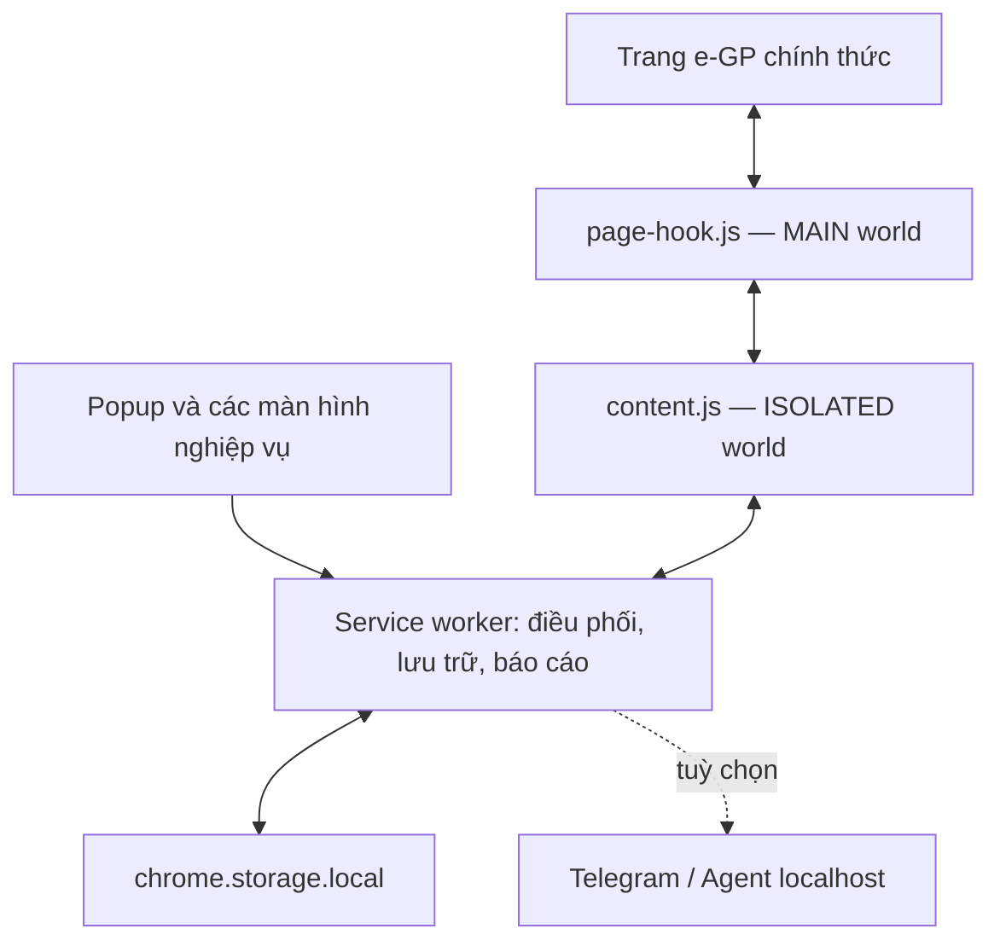

# Giáo Sư Cùi Bắp 4.0.0

**Trợ lý ra quyết định dự thầu ngay trên nguồn e-GP chính thức.**

Giáo Sư Cùi Bắp là extension Chrome dành cho doanh nghiệp và đội ngũ đấu thầu tại Việt Nam. Phần mềm hỗ trợ tìm kiếm, sàng lọc, theo dõi và quản lý cơ hội từ [Hệ thống mạng đấu thầu quốc gia (e-GP)](https://muasamcong.mof.gov.vn/), đồng thời cung cấp các góc nhìn về nhà thầu, chủ đầu tư, đối thủ và địa bàn. Địa chỉ pháp lý hiện hành chuyển người dùng tới host vận hành `muasamcong.mpi.gov.vn` mà extension đang hỗ trợ.

Phiên bản 4.0.0 tập trung vào ba mục tiêu: **quyết định nhanh hơn**, **truy vết được về nguồn chính thức** và **giảm rủi ro kỹ thuật khi cổng e-GP thay đổi**.

> Điểm phù hợp, độ đầy đủ dữ liệu và cảnh báo của extension là chỉ báo nội bộ để sàng lọc, không phải xác suất trúng thầu, kết luận pháp lý hay thay thế việc đọc hồ sơ mời thầu trên e-GP.

## Điểm mới nổi bật trong 4.0

- Dashboard điều hành với KPI, cơ hội ưu tiên, lọc/sắp xếp và phân trang.
- Pipeline Go/No-Go gồm: Mới phát hiện → Đang sàng lọc → Quyết định dự thầu → Đang lập HSDT → Đã nộp hoặc Không tham gia.
- Lưu người phụ trách, ghi chú nội bộ và thời điểm cập nhật cho từng cơ hội.
- Radar thay đổi theo dõi giá, hạn đóng thầu, tên gói, địa điểm và chủ đầu tư.
- Chỉ số độ đầy đủ dữ liệu và các cảnh báo có thể kiểm chứng.
- Khuyến nghị hành động tiếp theo theo trạng thái và mức ưu tiên.
- Cải thiện chuẩn hoá từ khoá, tiền tệ, ngày tháng, URL và nhận diện kết quả trúng thầu.
- Tăng an toàn khi giao tiếp với e-GP: giới hạn đúng miền/đường dẫn, loại bỏ trường nhạy cảm và dùng phiên bảo mật hiện hành của trang.
- Cô lập tác vụ theo mã công việc và tab; huỷ một tác vụ không làm dừng các tác vụ khác.
- Sửa cách tính liên danh để không nhân trùng toàn bộ giá trị gói thầu cho từng thành viên.
- Sao lưu an toàn loại bỏ bí mật Telegram; nhập dữ liệu luôn tắt tự động hoá và tích hợp ngoài cho đến khi người dùng chủ động bật lại.
- Bộ nhận diện mới, giao diện responsive và bộ kiểm thử hồi quy tự động.

Chi tiết thay đổi xem tại [CHANGELOG.md](CHANGELOG.md). Đánh giá kỹ thuật, rủi ro và lộ trình xem tại [BAO-CAO-DANH-GIA.md](BAO-CAO-DANH-GIA.md).

## Khả năng chính

| Nhóm | Khả năng |
|---|---|
| Tìm cơ hội | Tìm TBMT, KHLCNT, kết quả theo mã số thuế, biên bản mở thầu và cơ hội theo địa bàn |
| Sàng lọc | Chấm điểm phù hợp, chuẩn hoá dữ liệu, xếp hạng OPEN trước PLAN, đánh dấu cơ hội khẩn cấp |
| Ra quyết định | Pipeline Go/No-Go, người phụ trách, ghi chú, watchlist và khuyến nghị hành động |
| Theo dõi | Radar phát hiện thay đổi ở các trường quan trọng và lưu tối đa 20 mốc gần nhất cho mỗi gói |
| Phân tích | Hồ sơ nhà thầu 360, chủ đầu tư, đối thủ, địa bàn, giá trị trúng thầu và mức tập trung thị trường |
| Báo cáo | Xuất Excel, xuất dữ liệu di động, sao lưu/khôi phục và chẩn đoán đã ẩn thông tin nhạy cảm |
| Thông báo | Thông báo Chrome; Telegram là tuỳ chọn và chỉ hoạt động sau khi người dùng cấu hình |
| Tài liệu | Có thể gọi Agent cục bộ tại `localhost:1234` để tải E-HSMT khi người dùng chủ động yêu cầu |

## Kiến trúc

Extension sử dụng Manifest V3 và không có máy chủ trung gian của nhà phát triển.



### Thành phần

- `background.js`: service worker điều phối trạng thái, lịch chạy, tab/tác vụ, chuẩn hoá, tổng hợp, xuất tệp và thông báo.
- `page-hook.js`: quan sát và khởi tạo yêu cầu trên đúng trang e-GP, sử dụng token/phiên hiện hành do chính trang tạo.
- `content.js`: cầu nối cô lập giữa trang và service worker, có cơ chế DOM fallback, phân trang và huỷ tác vụ.
- `lib/`: các mô-đun nghiệp vụ thuần cho chuẩn hoá, quyết định, phân tích, Excel, nguồn dữ liệu, ẩn bí mật và xử lý liên danh.
- Các trang HTML/JS: Dashboard, Tìm TBMT, KHLCNT, Kết quả, Mở thầu, Nhà thầu, Chủ đầu tư, Địa bàn, Phân tích, Cài đặt, Chẩn đoán và Onboarding.

### Luồng dữ liệu e-GP

1. Người dùng tạo truy vấn trong extension.
2. Extension mở đúng trang lựa chọn nhà thầu của e-GP.
3. Trang e-GP tạo phiên/token bảo mật hiện hành và gửi yêu cầu tới endpoint công khai tương ứng.
4. Extension chỉ tiếp nhận dữ liệu cần thiết, chuẩn hoá và lưu cục bộ.
5. Mỗi kết quả giữ liên kết nguồn HTTPS về đúng miền `muasamcong.mpi.gov.vn` để người dùng kiểm tra.

Cách làm này giảm phụ thuộc vào URL, header, CAPTCHA hoặc token đã cũ. Tuy vậy, vì e-GP là hệ thống bên ngoài có thể thay đổi giao diện hoặc API, cần chạy checklist canary trước khi phát hành rộng.

## Yêu cầu hệ thống

- Google Chrome 111 trở lên trên máy tính.
- Có thể truy cập `https://muasamcong.mpi.gov.vn/`.
- Node.js 20 trở lên chỉ cần khi chạy bộ kiểm thử dành cho nhà phát triển.
- Telegram và Agent tải tài liệu cục bộ là tính năng tuỳ chọn.

## Cài đặt thủ công

1. Giải nén gói phát hành vào một thư mục ổn định. Chrome không nạp trực tiếp tệp ZIP.
2. Mở `chrome://extensions`.
3. Bật **Chế độ dành cho nhà phát triển**.
4. Chọn **Tải tiện ích đã giải nén**.
5. Chọn đúng thư mục chứa `manifest.json` của phiên bản 4.0.0.
6. Ghim biểu tượng Giáo Sư Cùi Bắp lên thanh công cụ.
7. Mở extension, đọc màn hình giới thiệu và cấu hình các tiêu chí phù hợp của doanh nghiệp.

### Nâng cấp từ 3.9.1

1. Ở phiên bản cũ, xuất bản sao lưu trước khi gỡ extension. Gỡ extension có thể xoá toàn bộ dữ liệu cục bộ.
2. Giữ lại thư mục/ZIP 3.9.1 và bản sao lưu để có đường lui.
3. Nạp phiên bản 4.0.0 theo hướng dẫn trên.
4. Nhập bản sao lưu.
5. Kiểm tra lại cài đặt. Vì lý do an toàn, quá trình nhập sẽ:
   - bỏ Bot Token và Chat ID Telegram;
   - tắt Telegram;
   - tắt quét theo lịch, quét khi khởi động và xuất tự động.
6. Chỉ nhập lại bí mật và bật tự động hoá sau khi kiểm tra canary thành công.

## Bắt đầu sử dụng

1. Mở **Cài đặt** và khai báo năng lực, từ khoá, địa bàn, khoảng giá trị và ngưỡng phù hợp.
2. Mở **Tìm TBMT** hoặc **KHLCNT**, nhập ít nhất một điều kiện rồi chạy tìm kiếm.
3. Nếu e-GP yêu cầu đăng nhập/CAPTCHA, hoàn tất trực tiếp trên trang chính thức.
4. Kiểm tra các trường quan trọng và liên kết nguồn trước khi đánh dấu **GO**.
5. Gán người phụ trách, ghi chú và cập nhật trạng thái pipeline.
6. Lưu bộ lọc, chạy lại để Radar phát hiện thay đổi.
7. Dùng Dashboard để tập trung vào cơ hội ưu tiên và gần hạn.

### Cách đọc các chỉ báo

- **Điểm phù hợp**: quy tắc xếp hạng nội bộ dựa trên cấu hình và dữ liệu đang có; không phải mô hình dự đoán trúng thầu.
- **Độ đầy đủ dữ liệu**: tỷ lệ trường quan trọng hiện có như mã, tên, giá, hạn, địa điểm, đơn vị và liên kết nguồn; không phải độ tin cậy thống kê.
- **Cảnh báo rủi ro**: chỉ nêu tín hiệu có thể kiểm tra như gần hạn, thiếu dữ liệu, từ khoá loại trừ hoặc thiếu liên kết chính thức; không kết luận sai phạm.
- **Radar thay đổi**: chỉ ghi nhận khi cả giá trị cũ và mới cùng tồn tại, nhằm tránh báo nhầm do một lần quét DOM bị thiếu trường.

## Quyền và quyền riêng tư

### Quyền Chrome

| Quyền | Mục đích |
|---|---|
| `storage`, `unlimitedStorage` | Lưu cấu hình, kết quả, pipeline, lịch sử quét và dữ liệu phân tích cục bộ |
| `alarms` | Chạy lịch quét/nhắc việc khi người dùng bật |
| `tabs` | Mở và gắn tác vụ với đúng tab e-GP |
| `downloads` | Xuất Excel/sao lưu và tải tệp do người dùng yêu cầu |
| `notifications` | Hiển thị thông báo trên máy |

### Miền được truy cập

| Miền | Mục đích |
|---|---|
| `https://muasamcong.mpi.gov.vn/*` | Đọc dữ liệu từ nguồn e-GP chính thức |
| `https://api.telegram.org/*` | Gửi cảnh báo khi người dùng tự cấu hình và bật Telegram |
| `http://localhost:1234/*` | Gọi Agent cục bộ để tải E-HSMT khi người dùng chủ động yêu cầu |

### Cam kết và giới hạn

- Không yêu cầu hoặc lưu mật khẩu e-GP.
- Không có máy chủ trung gian của nhà phát triển, quảng cáo hay hệ thống phân tích hành vi trong mã hiện tại.
- Dữ liệu nghiệp vụ được lưu trong `chrome.storage.local`; khi trình duyệt hỗ trợ, quyền đọc storage được giới hạn cho trusted contexts.
- Dữ liệu cục bộ không được mã hoá đầu-cuối. Người có quyền truy cập hồ sơ Chrome hoặc hệ điều hành có thể đọc được dữ liệu.
- Khi bật Telegram, nội dung cảnh báo rời khỏi máy và chịu chính sách của Telegram.
- **Sao lưu an toàn** loại Bot Token và Chat ID; **sao lưu đầy đủ** có thể chứa bí mật và không nên chia sẻ.
- Tệp chẩn đoán ẩn token, Chat ID và các giá trị nghiệp vụ nhạy cảm; tuy vậy vẫn nên kiểm tra trước khi gửi cho bên khác.
- Gỡ extension hoặc khôi phục cài đặt gốc có thể xoá dữ liệu không thể phục hồi. Luôn sao lưu trước.

Xem thêm tại màn hình `privacy.html` trong extension.

## Sao lưu và khôi phục

- Dùng **Sao lưu an toàn** khi cần chuyển máy hoặc gửi cho người hỗ trợ.
- Chỉ dùng **Sao lưu đầy đủ** để lưu giữ riêng tư; tệp có thể chứa thông tin tích hợp ngoài.
- Tệp nhập tối đa 15 MB. Dữ liệu được giới hạn kích thước, chuẩn hoá URL và loại bỏ trường bí mật trước khi lưu.
- Sau khi nhập, Telegram và mọi lịch tự động đều bị tắt để tránh gửi dữ liệu hoặc chạy tác vụ ngoài ý muốn.
- **Xoá dữ liệu** giữ lại một số cài đặt; **Khôi phục cài đặt gốc** xoá toàn bộ storage và lịch, yêu cầu xác nhận hai lần.

## Kiểm thử

Từ thư mục extension:

```bash
npm test
```

Bộ hiện tại kiểm tra chuẩn hoá văn bản/tiền/ngày, URL chính thức, request an toàn, ẩn bí mật, pipeline quyết định, xếp hạng, Radar, CSP/manifest, cú pháp/import JavaScript, tài nguyên giao diện, Excel và cách tính liên danh.

Kết quả tại thời điểm bàn giao 4.0.0: **44/44 kiểm thử tự động đạt**. Đây là bằng chứng hồi quy cục bộ, không thay thế kiểm thử trực tiếp trên e-GP, kiểm thử hiệu năng, rà soát Chrome Web Store hoặc kiểm toán bảo mật độc lập.

Môi trường bàn giao không có Chromium/Chrome nhị phân để chạy E2E giao diện thật. Vì vậy bản này được coi là **release candidate cho pilot/canary**, không phải bằng chứng tương thích tuyệt đối với phiên e-GP hiện hành. Biên bản kiểm thử chi tiết nằm tại [KIEM-THU-PHAT-HANH.md](KIEM-THU-PHAT-HANH.md).

## Canary e-GP trước khi dùng rộng

Chạy trên một Chrome profile thử nghiệm, chưa bật Telegram và lịch tự động:

- [ ] Ghi lại phiên bản Chrome, extension, thời điểm và trạng thái đăng nhập e-GP.
- [ ] Sao lưu dữ liệu và giữ bản 3.9.1 để rollback.
- [ ] Tìm một TBMT đã biết; đối chiếu mã, tên, giá, hạn, đơn vị, địa điểm và URL với trang nguồn.
- [ ] Thử truy vấn không có kết quả, có dấu/không dấu và ít nhất hai trang kết quả.
- [ ] Xác nhận kết quả phân trang một phần/giới hạn luôn được ghi rõ, không bị hiểu là đầy đủ.
- [ ] Lưu bộ lọc, quét lại và kiểm tra không tạo bản ghi trùng bất thường.
- [ ] Kiểm tra trạng thái, người phụ trách và ghi chú còn nguyên sau khi tải lại/quét lại.
- [ ] Kiểm tra Radar trên một gói đã sửa đổi hoặc bằng hai snapshot kiểm soát.
- [ ] Chạy song song ở hai tab, huỷ một tác vụ và xác nhận tác vụ còn lại tiếp tục.
- [ ] Kiểm tra KHLCNT, kết quả, mở thầu, địa bàn và chủ đầu tư; đặc biệt xác nhận giá trị liên danh không bị nhân trùng.
- [ ] Mở tệp Excel, bản sao lưu an toàn và tệp chẩn đoán; xác nhận không lộ Bot Token/Chat ID.
- [ ] Chỉ sau khi đạt các bước trên mới thử Telegram, lịch tự động và Agent cục bộ.

Tiêu chí đạt tối thiểu: không có lỗi runtime chặn luồng, không có URL ngoài nguồn chính thức trong kết quả, không sai trường ở mẫu đối chiếu, không báo đầy đủ khi dữ liệu còn một phần, không trùng bản ghi bất thường và dữ liệu vẫn còn sau khi khởi động lại Chrome.

## Xử lý sự cố

### Không lấy được dữ liệu

1. Kiểm tra đang ở đúng miền HTTPS của e-GP.
2. Tải lại trang, hoàn tất đăng nhập/CAPTCHA nếu được yêu cầu.
3. Chạy một truy vấn nhỏ với mã TBMT đã biết.
4. Mở trang **Chẩn đoán**, xuất tệp đã ẩn bí mật và ghi lại thời điểm, URL thao tác, trạng thái lỗi.
5. Nếu nghi e-GP vừa đổi cấu trúc, tắt lịch quét và không lặp yêu cầu liên tục.

### Dữ liệu chỉ có một phần

Kiểm tra số trang, giới hạn kết quả và trạng thái hoàn tất của tác vụ. Không dùng tổng hợp/so sánh thị trường như dữ liệu đầy đủ khi tác vụ đã timeout, bị huỷ hoặc mới thu được một phần.

### Telegram không gửi

Kiểm tra đã nhập lại Bot Token/Chat ID sau khi khôi phục, đã chủ động bật Telegram và trình duyệt có thể truy cập Telegram API. Không đưa token vào ảnh chụp hoặc tệp hỗ trợ.

### Cổng e-GP thay đổi

Tạm dừng tác vụ định kỳ, lưu tệp chẩn đoán đã ẩn bí mật, ghi rõ hành động gây lỗi và quay về bản ổn định nếu cần. Không chỉnh endpoint theo phỏng đoán trên môi trường sản xuất.

## Phạm vi chưa có trong 4.0

- Không có tích hợp OpenAI/AI tạo sinh trong mã hiện tại.
- Chưa tự đọc toàn bộ E-HSMT để sinh ma trận tuân thủ có trích dẫn trang/tệp.
- Chưa có đồng bộ đội nhóm đa thiết bị hoặc phân quyền cộng tác.
- Chưa liên kết hoàn chỉnh vòng đời KHLCNT → TBMT → sửa đổi → mở thầu → kết quả.
- Chưa có hệ thống dự báo giá hoặc xác suất thắng đã được kiểm định.
- Chưa cam kết tương thích tuyệt đối với mọi thay đổi tương lai của e-GP.
- Luồng quét chi tiết BBMT sẽ kết thúc an toàn bằng timeout nếu service worker bị Chrome dọn giữa chừng, nhưng chưa tự tiếp tục từ đúng gói đang quét; người dùng cần chạy lại tác vụ.

### Nguyên tắc nếu bổ sung OpenAI sau này

4.0.0 cố ý không yêu cầu người dùng dán OpenAI API key vào extension. Theo hướng dẫn bảo mật chính thức, API key là bí mật và không được lộ trong mã phía trình duyệt; một tính năng AI phát hành nghiêm túc cần backend kiểm soát quyền, redaction, quota và audit. Khi triển khai, nên dùng [Responses API](https://developers.openai.com/api/docs/guides/migrate-to-responses) cho ứng dụng mới và tuân thủ [production best practices](https://developers.openai.com/api/docs/guides/production-best-practices). Mọi tóm tắt E-HSMT phải là opt-in và dẫn về đúng tệp/trang nguồn.

## Tuyên bố sử dụng

Phần mềm hỗ trợ tra cứu và tổ chức thông tin. Người dùng chịu trách nhiệm kiểm tra dữ liệu trên e-GP, đọc đầy đủ hồ sơ, tuân thủ pháp luật và tự đưa ra quyết định dự thầu. Không nên sử dụng điểm số, cảnh báo hoặc phân tích của extension làm bằng chứng duy nhất cho quyết định tài chính, pháp lý hay cáo buộc đối với bất kỳ tổ chức/cá nhân nào.
